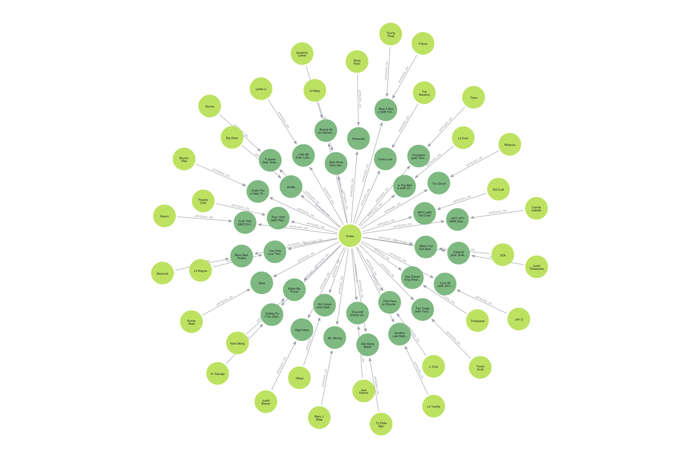

# Six Degrees of Spotify

## Description

This project finds the shortest path between two artists through collaborations, aiming for under 6 degrees of separation. It uses the [Spotify API](https://developer.spotify.com/documentation/web-api) to scrape artist and track data, stores it in a [Neo4j](https://neo4j.com/) graph database, and runs a shortest-path query to connect any two artists.



## Pre-requisites

* [Python 3.10](https://www.python.org/downloads/release/python-3100/)
* [Neo4j Account](https://neo4j.com/cloud/platform/aura-graph-database/)
* [Spotify Developer Account](https://developer.spotify.com/)

## Installation

1. Clone the repository
2. Install dependencies: `pip install -r requirements.txt`
3. Create a `.env` file in the root directory with the following variables:

```
SPOTIFY_CLIENT_ID=<your_spotify_client_id>
SPOTIFY_CLIENT_SECRET=<your_spotify_client_secret>
NEO4J_URI=<your_neo4j_uri>
NEO4J_USERNAME=<your_neo4j_username>
NEO4J_PASSWORD=<your_neo4j_password>
```

## Usage

Run with no flags to find the shortest path between two artists:

```
python main.py
```

You will be prompted to enter the names of the two artists.

## Flags

| Flag | Description |
|------|-------------|
| `-i` / `--init` | Full initialization from Spotify API — scrapes artists, albums, and tracks from scratch |
| `-s` / `--seed` | Resolve artists from `seeds.json` and merge into `artists.csv`, then update artist nodes in the database |
| `-u` / `--update` | Incrementally scrape albums for artists not yet scraped, re-filter tracks, and update the database |
| `-a` / `--artists` | Import artists from `artists.csv`, then scrape albums and tracks |
| `-t` / `--tracks` | Resume track scraping from existing `albums.csv` (use if track scraping was interrupted) |
| `-m` / `--imprt` | Import all data from existing csv files into the database |
| `--stats` | Print database statistics (summary counts, most connected artists, biggest collabs, approximate diameter) |
| `-d` / `--debug` | Verify the database connection |
| `-c` / `--clear` | Clear the database |

## Data Initialization

There are two sources for artists:

**Genre-based** (`-i`): Searches Spotify for the top artists in each genre listed in `data/genres.json`. Currently configured genres:

```
dance, dubstep, edm, electro, electronic, hip-hop, house, indie, indie-pop, k-pop, pop, progressive-house, r-n-b
```

A full list of available Spotify genres is in `data/all_genres.json`. To change which genres are scraped, edit `data/genres.json`.

**Seed-based**: Resolves a curated list of artist names from `data/seeds.json` directly by name, guaranteeing specific artists are included regardless of their genre classification on Spotify. Useful for artists who are popular but not tagged with a genre (e.g. artists on hiatus). To add artists, append their names to `data/seeds.json`.

Resolved seed names are cached in `data/seeds_cache.json` (name → Spotify ID). On subsequent runs of `-s`, seeds already in the cache and already present in `artists.csv` are skipped entirely — no API calls are made for them. The cache is initialized automatically from `artists.csv` on first run.

Only artists with a popularity score ≥ 40 are kept.

## Pipeline

The full data pipeline runs in three stages, each saved to a csv checkpoint:

1. **Artists** → `data/artists.csv`
2. **Albums** → `data/albums.csv`
3. **Tracks** → `data/tracks.csv`

The existing csv files in the repository (`data/artists.csv`, `data/albums.csv`, `data/tracks.csv`) are pre-populated with seeded data and can be loaded directly into the database using `python main.py -m`, skipping the Spotify scraping steps entirely.

> **Note:** Full initialization (`-i`) can take around 30 minutes due to the volume of data and the number of Spotify API calls required. Using `-m` to load the pre-populated CSV files is recommended unless you need a fresh scrape.

All three scraping stages are internally checkpointed — if interrupted, re-running the same command resumes from where it left off:

| Stage | Resume command | Checkpoint files |
|-------|---------------|-----------------|
| Seed artists | `python main.py -s` | `artists_offset.txt`, `artists_raw.jsonl` |
| Albums | `python main.py -a` or `python main.py -i` | `albums_offset.txt`, `albums_raw.jsonl` |
| Incremental albums | `python main.py -u` | `albums_inc_offset.txt`, `albums_inc_raw.jsonl` |
| Tracks (scraping) | `python main.py -t` | `tracks_offset.txt`, `tracks_raw.jsonl` |
| Tracks (filtering) | `python main.py -t` | `tracks_raw.jsonl` |

Checkpoint files are deleted automatically on successful completion. `tracks_raw.jsonl` is kept until both scraping and filtering complete — if filtering is interrupted (e.g. by an API timeout), re-running `python main.py -t` reloads tracks from the raw file without re-scraping. If the pipeline is interrupted between stages (e.g., after albums but before tracks), run `python main.py -t` to resume from `albums.csv` without re-scraping albums.

## Adding New Artists

To add specific artists to an existing database without a full re-initialization:

1. Append artist names to `data/seeds.json`
2. Run `python main.py -s` — resolves new names, merges into `artists.csv`, updates artist nodes in the database
3. Run `python main.py -u` — scrapes albums only for the newly added artists, re-filters tracks to find new collaborations, and updates the database

## License

This project is licensed under the MIT License — see the [LICENSE](LICENSE) file for details.
